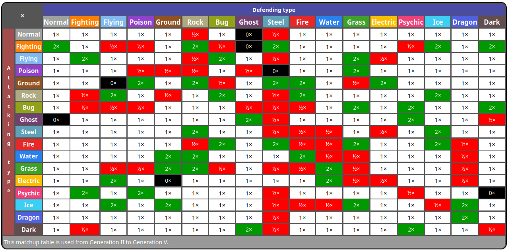

# JPokeBattle
Adan Giulio Formisano - 1813917

# Indice
- [JPokeBattle](#jpokebattle)
- [Indice](#indice)
- [JPokeBattle](#jpokebattle-1)
  - [Risorse](#risorse)
  - [Features Implementate](#features-implementate)
- [Descrizione Generale](#descrizione-generale)
  - [Statistiche Pokémon](#statistiche-pokémon)
  - [Battaglia tra Pokémon](#battaglia-tra-pokémon)
    - [Ordine di Esecuzione](#ordine-di-esecuzione)
    - [Target](#target)
    - [Calcolo dei Danni](#calcolo-dei-danni)
- [Implementazione](#implementazione)
  - [Game Engine](#game-engine)
    - [`GameController` e `GameData`](#gamecontroller-e-gamedata)
    - [`Pokemon`](#pokemon)
      - [Stats dei Pokèmon](#stats-dei-pokèmon)
    - [`Battle`](#battle)
      - [Moves](#moves)
  - [Applicazione GUI (JavaFX)](#applicazione-gui-javafx)
    - [`SceneController`](#scenecontroller)
    - [Interfacce principali](#interfacce-principali)
- [Design Pattern](#design-pattern)
- [Applicazione di paradigmi di programmazione](#applicazione-di-paradigmi-di-programmazione)

# JPokeBattle
*JPokeBattle* è un progetto che implementa una versione ridotta del sistema di battaglie del videogioco *Pokémon*, in particolare questa implementazione cerca di seguire il più possibile i videogiochi della 3ª Generazione.

Questo progetto è stato sviluppato da una singola persona, come progetto d'esame per *Metodologie di Programmazione* e segue la [traccia](./progetto%20MDP%20A-L%2023_24.pdf) fornita dal professore.

La repository è presente su [GitHub](https://github.com/AdanFormisano/JPokeBattle).

## Risorse
- Java JDK 23
- JavaFX
- [Bulbpedia](https://bulbapedia.bulbagarden.net/wiki/Main_Page) - Utilizzato per le statistiche del gioco e altre informazioni relative ai giochi *Pokémon*
- [The Cave of Dragonflies](https://www.dragonflycave.com/) - Utilizzato come fonte di informazioni dettagliate sulle meccaniche di gioco da implementare
  

## Features Implementate
L'implementazione realizza **Feature - Comuni** e **Feature - Sviluppatore Singolo** di livello **Minimo**, **Tipico** ed **Extra** (*Set Crescita*).
- **Feature - Comuni**
  - *Minimo*
    - Implementare Bulbasaur, Charmander, Squirtle
    - Implementare statistiche base dei pokémon
    - Assegnare a tutti i Pokémon le due mosse di tipo neutro apprese al livello 1 (growl e tackle per Bulbasaur, growl e scratch per Charmander, tail whip e tackle per Squirtle)
    - Implementare le schermate “start”, battaglia, cambio pokémon, “you win”, e “game over”
  - *Tipico*
    - Implementare tutte le mosse dei Pokémon scelti, rispettando le loro meccaniche di funzionamento dipendenti dai loro tipi, ma ignorando i cambiamenti di stato come avvelenamento, stordimento, etc.
  - *Extra - Set Crescita*
    - Implementare punti individuali e punti allenamento che migliorino le capacità dei pokémon sulla base delle vittorie, aggregandoli appropriatamente
    - Implementare i meccanismi di passaggio di livello ed evoluzione dei Pokémon, incluso l’apprendimento di nuove mosse (rispettando il vincolo delle 4 mosse a disposizione di ciascun pokémon nella lotta: l’allenatore deve decidere, nel momento in cui una nuova mossa diventa disponibile ed il pokémon già ne conosce 4, se apprendere la nuova, dimenticandone una delle precedenti a scelta)

- **Feature - Sviluppatore Singolo**
  - *Minimo*
    - Far affrontare al giocatore una serie di avversari NPC, fino alla sua prima sconfitta
  - *Tipico*
    - Preservare lo stato dei pokémon del giocatore nella serie di lotte (e.g., se un Pokémon riceve 10 PS di danno nella prima lotta, partirà con 10 PS in meno nella seguente, etc.)
    - Implementare una schermata leaderboard che mantenga i 10 record migliori (numero di lotte vinte in serie)

# Descrizione Generale
In questa implementazione semplificata di *Pokémon*, viene per prima cosa presentata all'utente la classica scelta degli *starters* della prima generazione (Bulbasaur, Charmander, Squirtle). Una volta eseguita la scelta iniziale viene generata una battaglia contro un pokémon scelto casualmente.

Ogni battaglia viene generata casualmente, i pokémon che possono essere scelti sono i 3 starters e ognuna delle loro 3 evoluzioni. Ogni volta che l'utente è riesce a sconfiggere il pokémon, o tutti i pokémon, della battaglia corrente, la prossima battaglia verrà generata con pokémon incrementati di un livello (e.g. al livello 5 si affrontano pokémon di livello 5, se si supera tale livello i pokémon generati saranno di livello 6). Questo *game loop* continua fino a quando l'untente non ha più alcun pokémon da utilizzare in una battaglia.

Quando l'utente viene sconfitto, gli viene presentato un resoconto della partita, con la sua squadra di pokèmon, il pokèmon da cui è stato sconfitto, e una lista di battglie/pokémon contro cui ha vinto fino a quel punto. Inoltre, l'utente può decidere di aprire e visualizzare la classifica delle 10 migliori partite che ha giocato.

## Statistiche Pokémon
Come già menzionato, l'implementazione dei pokémon segue quella della 3ª Generazione, ma leggermente semplificata, in particolare le statistiche vengono calcolate secondo la [formula](https://www.dragonflycave.com/mechanics/stats):
$$
Stat = floor(floor((2*B + I + E) * L / 100 + 5) * N)
$$

Invece, per gli *Hit Points*
$$
Stat = floor((2 * B + I + E) * L / 100 + L + 10)
$$

Dove i simboli rappresentano,
- $B$: Statistiche base, dalla 3ª Generazione in poi vengono aggiunti anche *Special Attack* e *Special Defense*.
- $I$: *Individual Value*, una per ogni statistica base, con range di valori $[0, 31]$, vengono però ignorate le [caratteristiche](https://bulbapedia.bulbagarden.net/wiki/Individual_values#Characteristic) dei pokémon.
- $E$: *Effort Value*, una per ogni statistica base, con range di valori $[0, 255]$; a differenza delle generazioni precedenti, in questa ogni specie pokémon ha un valore che "cede" al pokémon da cui viene sconfitto  (vengono tralasciati gli altri metodi di acquisizione dei punti EV, e.g. vitamine, EXP Share, ecc.).
- $L$: livello attuale del pokémon.
- $N$: la [natura](https://bulbapedia.bulbagarden.net/wiki/Nature) del pokémon.

## Battaglia tra Pokémon
Le duelli che l'utente esegue durante una partita seguono le classiche regole dei videogiochi, ignorando però gli effetti di stato (come indicato dalla traccia del progetto); in particolare, è seguita la tabella dei tipi della 3ª generazione

### Ordine di Esecuzione
L'ordine con cui avviene un turno è:

1. Vengono scelte le mosse da eseguire in questo turno
2. Vengono confrontate le priorità delle mosse scelte dall'utente e dal pokémon avversario
3. In caso di parità ugale tra le due mosse, viene calcata la velocità dei pokémon in battaglia: il più veloce sarà il primo ad eseguire la propria mossa
4. Viene verificato che la mossa abbia sucesso ed effettivamente riesca a colpire l'avversario, in caso il colpo machi il bersaglio viene eseguita la mossa dell'avversario
5. Se la mossa colpisce, vengono calcolati e applicati i danni della prima mossa
6. Nel caso in cui il primo pokémon colpito non sia svenuto, allora viene eseguita anche la sua mossa
7. Viene controllato se è svenuto qualche pokémon
8. Nel caso in cui sia svenuto un pokémon, e il "propetario" abbia ancora pokémon a disposizione, viene mandato in campo il primo pokémon disponibile
9. Terminata la battaglia, se il giocatore ha vinto, vengono distribuiti gli EV e gli EXP

### Target
A differenza della 3ª Generazione, dove sono state aggiunte le battaglie di coppia, in questa implementazione le battaglie sono solo 1v1

### Calcolo dei Danni
I danni subiti da un Pokémon vengono calcolati con la seguente [formula](https://bulbapedia.bulbagarden.net/wiki/Damage#Generation_III), 
$$
    Damage=\Biggl(\Biggl(\frac{(\frac{2 \times Level}{5} + 2)\times Power \times \frac{A}{D}}{50}\Biggl) + 2 \Biggl)\times \text{STAB} \times \text{Type1} \times \text{Type2} \times \text{random}
$$

Dove i simboli rappresentano,
- $Level$: Livello del Pokémon attaccante.
- $Power$: L'effettiva potenza della mossa.
- $A$: L'effettiva statistica di *Attacco* del Pokémon attaccante, se la mossa è di tipo *fisico*, altrimenti se la mossa è una *mossa speciale* la statistica coincide con *Special Attack*.
- $D$: L'effettiva statistica di *Difesa* del Pokémon difensore, se la mossa è di tipo *fisico*, altrimenti se la mossa è una *mossa speciale* la statistica coincide con *Special Defense*.
- $\text{STAB}$: É un bonus pari a $1.5$ nel caso in cui il tipo della mossa sia uguale ad uno dei due tipi del Pokémon attaccante, vale $1$ altrimenti.
- $\text{Type1}$ e $\text{Type2}$: Sono i valori di "efficacia del tipo" delle mossa contro il primo e secondo tipo del pokémon difensore.
- $random$: Viene calcolato mediante la moltiplicazione per un numero intero casuale, distribuito uniformemente tra $[85, 100]$, seguita da una divisione intera per $100$.

Per quanto riguarda $A$ e $D$, vengono prima moltiplicati per il modificatore dello *stage* (statistica che può essere modificata usando delle mosse specifiche, principalmente mosse di categoria *Status*).

# Implementazione
Il progetto è strutturato in due macro-sezioni:
  - **Game Engine**: gestisce integralmente tutte le meccaniche di gioco, definendo la logica e il funzionamento interno del sistema.
  - **Interfaccia Utente**: si occupa dell'interazione tra l'utente e il game engine, offrendo una GUI e implementando i meccanismi necessari per la comunicazione bidirezionale tra le due componenti.

## Game Engine
Il *"game engine"* gestisce il back-end del gioco ed è in grado di creare ed eseguire delle battaglie tra pokémon, generando ogni volta che sia necessario una nuova battaglia.

I componenti principali sono: `GameController`, `GameData`, `Pokemon`, `Battle`.

### `GameController` e `GameData`
La classe `GameController` contiene le istanze fondamentali per la corretta esecuzione del progetto. Infatti, è qui che vengono mantenuti gli oggetti principali:

- `GameData`: Mantiene la squadra pokémon dell'utente e dell'attuale avversario, la classifica di tutte le partite giocate;
- `currentBattle`: L'istanza della battaglia attualmente in corso;
- `gameStateListener`: Un *observer* degli stati del gioco, questo componente è essenziale per la comunicazione con l'interfaccia utente

È fondamentale che `GameController` implementi l'interfaccia `IBattleEventListener`, questo gli permette di riceve gli aggiornamenti di stato dalla `currentBattle`. Gli eventi principali che vengono comunicati sono:

- Lo svenimento di un pokémon, sia dell'utente che dell'avversario;
  - Il proseguimento della battaglia nel caso in cui sia possibie sostituire il pokèmon svenuto dell'utente;
- L'aumento di livello dopo una vittora, nel caso in cui il pokèmon dell'utente guadagli abbastanza punti esperienza;
- La conclusione di una battaglia;

La maggior parte degli eventi che la classe riceve dal `currentBattle` devono poi essere propagati all'interfaccia utente, mediante lo `gameStateListener`.

### `Pokemon`
I *Pokémon* sono rappresentati dall'omonima classe che ne implementa gli aspetti fondamentali, in particolare:

- ID, Nome, Natura;
- `BaseStats`: Ossia le statistiche intrinsiche di una specie di Pokèmon;
- `Stats`: Le effettive statistiche principali tra cui anche il livello; 
- Informazioni riguardanti l'evoluzione (livello di evoluzione e in quale pokèmon si evolverà);
- Una flag per indicare se il pokèmon è svenuto;
- Il set di mosse che è in grado di effettuare;
- Le immagini necessarie per rappresentarlo nell' interfaccia utente;

Tutti i dati necessari alla creazione di un'istanza di un Pokémon sono contenuti in un file JSON, che viene letto dal `PokeLoader` e salvato all'interno della classe `DataPokemon`. Quest'ultima funge da contenitore per le informazioni di ogni specie implementata. Questa scelta consente di mantenere la classe `Pokemon` focalizzata sulla rappresentazione concreta di un Pokémon in gioco, separandola concettualmente dai dati statici necessari alla sua creazione.

#### Stats dei Pokèmon
Le statistiche di *Attack*, *Defense*, *Special Attack*, *Special Defense*, *Speed*, *CurrentHP* e *MaxHP* vengono calcolate e mantenute in questa classe a partire dalle `BaseStats`, anche gli *Effort Value* (EV) e gli *Individual Value* (IV) vengono gestiti all'interno di questa classe.

La classe contiene metodi appositi utilizzati per aggiornare le statistiche nei casi in cui è richiesto, per esempio all'aumento di livello del pokémon oppure nel momento in cui, vinta una battaglia, gli vengono assegnati gli EV guadagnati.

Per quanto riguarda l'esperienza necessaria al pokémon per salire di livello, viene seguita l'implementazione dei videogiochi: ogni specie appartiene ad una "categoria" di *EXP yield* per il quale può guadagnare punti esperienza in maniera più o meno veloce (anche questa statistica viene mantenuta nella class `Stats`).

### `Battle`
La classe `Battle` gestisce la battaglia attuale o quella in fase di avvio, coordinando l'esecuzione delle mosse e, di conseguenza, l'alternanza dei turni tra l'utente e l'avversario NPC, ciascuno con la propria squadra di Pokémon.

Per quanto riguarda lo svolgimento dei turni, è l'utente, attraverso la GUI, a dare inizio al turno scegliendo quale mossa far eseguire al proprio Pokémon tra quelle disponibili.

#### Moves

Nel progetto, le mosse dei Pokémon sono suddivise in due categorie principali per semplicità:

- Mosse che infliggono danno.
- Mosse che applicano uno Status positivo o negativo.

Tutte le mosse sono rappresentate dalla classe `Move`, che contiene le informazioni di base come:

- Nome
- Tipo
- Categoria
- PP
- Accuracy
- Priorità

Ogni `Move` utilizza un'implementazione specifica della strategia di esecuzione, rappresentata dall'interfaccia `MoveStrategy`. Esistono due strategie principali:

- `MoveDamageStrategy`: Implementa il calcolo e l'applicazione del danno a un Pokémon avversario.

- `MoveStatusStrategy`: Implementa la modifica dello stage delle statistiche del Pokémon bersaglio.

Questa separazione segue il Strategy Pattern, consentendo una gestione più flessibile delle mosse.

Per separare i dati statici della mossa dalla sua rappresentazione in gioco, viene utilizzata la classe `DataMove`, che memorizza i dati letti da un file JSON tramite `MoveLoader`.

Tutte le mosse presenti nel progetto vengono generate attraverso la `MoveFactory`, che, data una stringa contenente il nome di una mossa, restituisce un'istanza di `Move` con la strategia appropriata (`MoveDamageStrategy` o `MoveStatusStrategy`) in base alla categoria della mossa.

## Applicazione GUI (JavaFX)
L'interfaccia utente del progetto è implementata utilizzando la libreria JavaFX, che adotta un sistema di *scene* per gestire e visualizzare le diverse schermate di gioco.

La gestione delle scene è affidata alla classe `SceneController`, che coordina l'interfaccia reagendo agli eventi generati dal back-end e mostrando la scena appropriata in base al contesto.

### `SceneController`
La classe `SceneController` è fondamentale per il funzionamento della GUI, in quanto implementa l'interfaccia `IGameStateListener`, che le consente di ricevere aggiornamenti di stato dal back-end.

Ogni volta che è necessario, il `GameController` notifica il `SceneController` tramite i metodi dell'interfaccia, permettendo alla GUI di reagire ai seguenti eventi:

  - Inizio della partita;
  - Selezione del Pokémon iniziale;
  - Inizio e termine di una battaglia;
  - Svenimento di un Pokémon;
  - Level up di un Pokémon;
  - Apprendimento di nuove mosse o necessità di dimenticarne una per apprenderne un'altra;
  - Evoluzione di un Pokémon;
  - Possibilità di aggiungere un nuovo Pokémon alla squadra dell'utente;
  - Richiesta di scambiare il Pokémon attualmente in campo con un altro della squadra.

### Interfacce principali
Le interfacce principali presentate all'utente sono:

  - `StatsView`: Mostra le statistiche dei due Pokémon in campo, sia dell'utente che dell'avversario; è in grado di "reagire" a qualsiasi modifica delle statistiche grazie alla loro implementazione utilizzando un `ObjectProperty` che consente a JavaFX di rilevare automaticamente qualsiasi cambiamento e aggiornare l'interfaccia di conseguenza
  - `ArenaView`: Visualizza le sprite dei Pokémon durante la battaglia. Per il Pokémon dell'utente viene mostrata la `spriteBack` (vista da dietro), mentre per l'avversario la `spriteFront` (vista frontale).
  - `OptionsView`: Contiene i pulsanti per avanzare nel gioco o cambiare il contenuto della `DynamicView`, alternando tra la visualizzazione delle mosse disponibili e la lista dei Pokémon della squadra dell'utente.
  - `DynamicView`: La componente più complessa, in quanto deve adattarsi a diversi tipi di messaggi e interfacce. In particolare, può mostrare:
    - Le mosse disponibili del Pokémon attualmente in campo.
    - La lista dei Pokémon disponibili per essere mandati in battaglia.
    - L'interfaccia per far dimenticare una mossa al Pokémon, nel caso abbia già appreso quattro mosse.
    - L'interfaccia di sconfitta.
    - Il messaggio di vittoria.
    - Il messaggio di svenimento di un Pokémon.
    - Il messaggio di apprendimento di una nuova mossa.
    - Il messaggio di evoluzione del Pokémon.

Il comportamento di `DynamicView` è reso possibile grazie all'implementazione di `DynamicViewModel`, una classe il cui compito è notificare a `DynamicView` lo stato corrente in cui si trova il `SceneController`.

Questo è realizzato tramite un componente di tipo `ObjectProperty`. In particolare, il `DynamicViewModel` utilizza:

  - `DynamicViewUIState`: Rappresenta uno degli stati possibili di DynamicView.
  - `DynamicViewData`: Un *wrapper* contenente i dati necessari per generare la versione corretta di `DynamicView` in base allo stato attuale.

# Design Pattern
Il progetto implementa diversi pattern di programmazione, principalmente:

- ***Singleton***: Utilizzato per `GameController` e `SceneController`.
- ***Observer***: Le interfacce `IGameStateListener` e `IBattleEventListener` permettono l'osservazione degli stati di gioco.
- ***Factory***: Utilizzato per la creazione delle mosse tramite `MoveFactory`.
- ***State***: Consente a `DynamicView` di adattare interfaccia e comportamento in base allo stato impostato da `SceneController`.
- ***Command***: Implementa la gestione degli input dell'utente nel gioco.
- ***Strategy***: Move utilizza `MoveStrategy`, permettendo una separazione tra il comportamento delle mosse di danno (`MoveDamageStrategy`) e delle mosse di status (`MoveStatusStrategy`).

# Applicazione di paradigmi di programmazione
Il progetto segue principalmente il paradigma della programmazione orientata agli oggetti (OOP), organizzando il codice in classi che rappresentano le entità di gioco, come `Pokemon`, `Move`, `Battle` e `GameController`. Inoltre, viene applicato il paradigma *event-driven*, grazie all'uso dell'*Observer Pattern* con `IGameStateListener` e `IBattleEventListener`, che permettono una comunicazione efficace tra il game engine e la GUI.

Sono stati implementati elementi della programmazione funzionale, come `Consumer<Pokemon>` utilizzato in `SceneController` per rendere più flessibile la gestione degli eventi di cambio Pokémon.

L'utilizzo del `Strategy Pattern` nelle mosse dei Pokémon ha consentito di disaccoppiare il comportamento delle mosse stesse dalla loro rappresentazione, rendendo il codice modulare ed estendibile.

